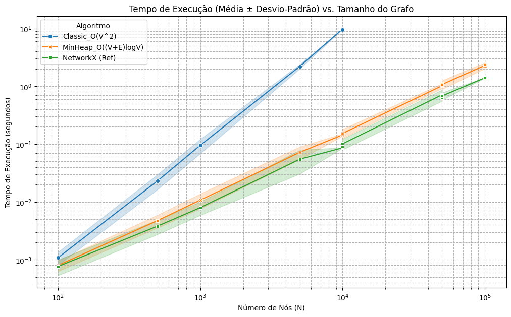
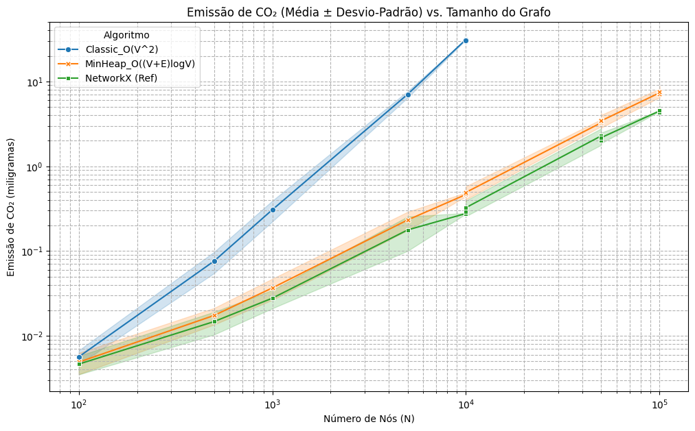
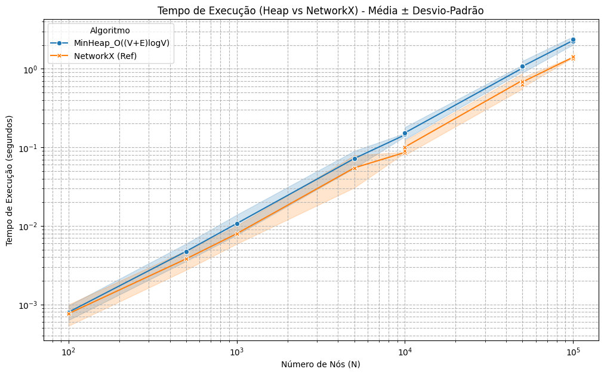

  <strong>UNIVERSIDADE FEDERAL DO RIO GRANDE DO NORTE (UFRN)</strong>
   
  <strong>Alunos:</strong>
   
  Juan Pablo
   
  Lucas Gabriel

 

# 📊 Análise de Performance e Pegada de Carbono (CO₂) de Algoritmos de Dijkstra

Este projeto, desenvolvido como parte da disciplina de **Algoritmos e Estrutura de dados 2** na UFRN, analisa e compara empiricamente a performance de três implementações do algoritmo de Dijkstra para encontrar o caminho mínimo em grafos.

O objetivo principal é avaliar o **tempo de execução (em segundos)** e a **pegada de carbono (em mg de CO₂)** de cada abordagem, medindo como elas escalam com o aumento do número de nós no grafo (de 100 a 100.000 nós).

### 📹 [Link para a Apresentação em Vídeo](https://www.youtube.com/watch?v=COLOQUE-O-LINK-AQUI)

---

## 🚀 Algoritmos Analisados

Foram comparadas três implementações distintas:

1.  **Dijkstra Clássico (O(V² + E))**: Implementação em Python puro, reutilizada das aulas, que usa uma busca linear (`getVertexWithMinDistance`) para encontrar o próximo nó de menor distância.
2.  **Dijkstra com Min-Heap (O((V + E) * log V))**: Implementação em Python puro, também das aulas, que otimiza a busca pelo nó de menor distância usando uma estrutura de dados Min-Heap.
3.  **NetworkX (Referência)**: Utilização da função `nx.single_source_dijkstra_path_length` da biblioteca NetworkX, que serve como *baseline* de alta performance (otimizada em C).

## 🛠️ Tecnologias Utilizadas

* **Google Colab**: Ambiente de desenvolvimento em nuvem.
* **Python 3**: Linguagem principal.
* **NetworkX**: Para geração de grafos e como algoritmo de referência.
* **CodeCarbon**: Para medição da pegada de carbono de cada execução.
* **Pandas**: Para estruturação e análise estatística dos dados.
* **Seaborn & Matplotlib**: Para visualização dos resultados (gráficos e tabelas).

## ⚙️ Como Executar o Projeto

O notebook (`.ipynb`) contém todo o código e está dividido em duas partes principais: a execução do experimento e a análise dos dados.

**Atenção:** A execução completa do experimento (Célula 9) pode levar várias horas.

### Opção 1: Analisar os Dados Já Coletados (Recomendado)

1.  Abra o arquivo `analise_dijkstra.ipynb` no Google Colab.
2.  Execute as **Células 1 a 6** para instalar as bibliotecas e definir todas as funções.
3.  **Pule** as Células 7, 8 e 9 (que rodam o experimento).
4.  Execute a **Célula 12** (que define as funções de análise de Média/Desvio-Padrão).
5.  Execute a **Célula 13**:
    * Ela pedirá que você faça o upload do arquivo `resultados_brutos.csv` (que está neste repositório).
    * Após o upload, ela irá gerar a tabela de estatísticas completa e todos os gráficos.

### Opção 2: Rodar o Experimento do Zero

1.  Abra o arquivo `analise_dijkstra.ipynb` no Google Colab.
2.  Execute as **Células 1 a 8**.
3.  Execute a **Célula 9**. Isso iniciará o experimento completo (pode demorar horas).
4.  Após a conclusão, os resultados serão salvos e os gráficos (com Intervalo de Confiança) serão gerados.

## 📈 Resultados: Análise Gráfica (Média ± Desvio-Padrão)

Os gráficos abaixo foram gerados usando a **Opção 1** (Células 12 e 13) e mostram a média dos resultados com barras de erro indicando $\pm$ 1 desvio-padrão.

### 1. Tempo de Execução vs. Tamanho do Grafo (Log-Log)

**Análise:** O gráfico confirma a complexidade teórica. O Dijkstra Clássico (O(V²)) cresce quadraticamente e se torna inviável rapidamente. O Min-Heap (O((V+E)logV)) e o NetworkX escalam de forma muito mais eficiente (quase linear), sendo que o NetworkX é consistentemente mais rápido por ser otimizado em C.

### 2. Emissão de CO₂ vs. Tamanho do Grafo (Log-Log)

**Análise:** A emissão de CO₂ está diretamente correlacionada com o tempo de execução e o uso de CPU. O algoritmo Clássico (O(V²)) não só é mais lento, mas também gasta significativamente mais energia, resultando em uma pegada de carbono muito maior.

### 3. Comparação (Heap vs. NetworkX)

**Análise:** Isolando os dois algoritmos rápidos, vemos que a implementação em Python puro com Min-Heap se comporta muito bem, com uma curva de crescimento paralela à do NetworkX, provando a eficiência da otimização com heap.